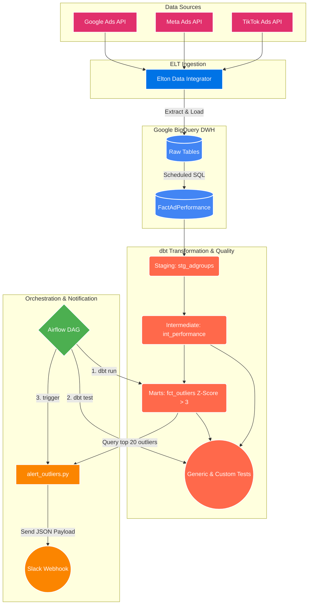

# 🚀 Ads Data Warehouse & Anomaly Detection Framework

An end-to-end data engineering and analytics pipeline built to ensure data quality and detect ad spend anomalies across multiple platforms (TikTok, Meta, Google). 

This project demonstrates a modern **ELT** approach where Data Integration (Elton Data) and Core Data Warehousing (BigQuery SQL) are handled upstream, while **dbt** is utilized strategically for **Data Quality, Business Rules, Anomaly Detection, and Alerting**.

---

## 🏗️ Architecture & Data Flow

The data flows continuously from the Ad platforms into our BigQuery landing zone, through the dbt transformation and testing layer, and finally into an automated Airflow alert pipeline.



### Flow Breakdown:
1. **Extraction**: Elton Data connects to TikTok, Meta, and Google APIs and dumps raw JSON/CSV data.
2. **Loading**: Raw data lands in BigQuery datasets (e.g., `company_a_tiktok_ads`).
3. **Core Transformation**: A scheduled BigQuery job aggregates the raw tables into a unified `FactAdPerformance` table.
4. **dbt Layer**: 
   - Reads from `FactAdPerformance`.
   - Runs structural tests (nulls, uniqueness).
   - Calculates statistical anomalies: *Daily Spend vs. Historical (Mean + 3 Standard Deviations)*.
5. **Orchestration**: Apache Airflow runs daily (`ads_outlier_detection_daily`), executing `dbt run`, `dbt test`, and triggering the Python alert script.
6. **Alerting**: `alert_outliers.py` queries the dbt anomaly model and pushes a formatted message to Slack.

---

## 🛠️ Technology Stack
- **Data Warehouse**: Google BigQuery
- **Data Transformation & Testing**: dbt (Data Build Tool)
- **Orchestration**: Apache Airflow
- **Scripting & Alerting**: Python (Google Cloud BigQuery Client, Requests)
- **Ingestion**: Elton Data (Third-party ELT)

---

## 📂 Project Structure (dbt)

```text
├── dags/
│   └── ads_outlier_detection_dag.py    # Airflow DAG for daily execution
├── models/
│   ├── staging/                          # Source definitions and light renaming
│   │   └── tiktok/
│   ├── intermediate/                     # Joins between dimensions and metrics
│   │   └── tiktok/
│   └── marts/                            # Business logic and Outlier Detection
│       └── ads/
│           └── fct_ad_performance_outliers.sql  # Z-score statistical anomaly model
├── scripts/
│   └── alert_outliers.py               # Queries BQ and hits Slack Webhook
├── dbt_project.yml
└── profiles.yml
```

---

## 💡 Key Features
* **Statistical Anomaly Detection**: Instead of hardcoding spend thresholds (which break as budgets scale), the pipeline calculates a dynamic **Z-score** for each ad group daily. If an ad's spend is 3 standard deviations above its historical mean, it is flagged.
* **Decoupled Data Quality**: By keeping the heavy ELT logic outside of dbt and utilizing dbt purely for the Quality and Marts layer, the CI/CD pipeline runs significantly faster and focuses on testing data rather than moving it.

---

## 🚀 How to Run Locally

If you want to clone and run this logic locally without BigQuery access, this project is optimized to run with **DuckDB**.

1. **Prerequisites**:
   - Python 3.9+
   - `pip install dbt-duckdb`
2. **Export Data**:
   - Export your `FactAdPerformance` data to a `data/` folder as `.csv` or `.parquet`.
3. **Configure Profile**:
   - Create a `profiles.yml` pointing your target to the local DuckDB instance.
4. **Execute**:
   ```bash
   dbt deps
   dbt build --select fct_ad_performance_outliers
   ```
